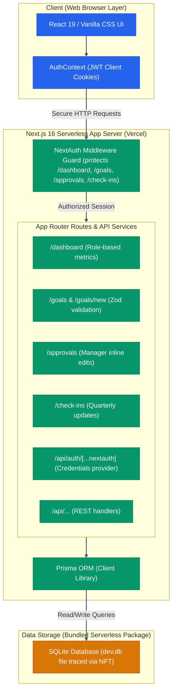

# ATOMQUEST HACKATHON 1.0 - Submission Document

This document contains the final submission requirements for the **AtomQuest Goal Setting & Tracking Portal** hackathon, including the working live URL, the verified source code repository, and a detailed architecture diagram.

---

## 🔗 1. Working Live Deployment URL
You can access and test the fully deployed application live on the internet at:
👉 **[https://atom-quest-cyan.vercel.app](https://atom-quest-wuzp.vercel.app/login)**

---

## 💻 2. Source Code Repository
The complete source code, Prisma migrations, and configurations are securely hosted and publicly accessible at:
👉 **[https://github.com/Praveenpadidapu/AtomQuest](https://github.com/Praveenpadidapu/AtomQuest)**

---

## 🏗️ 3. Project Architecture Diagram

This diagram visualizes how the **Next.js 16 (App Router)** frontend, the stateless **NextAuth JWT secure middleware**, **Prisma ORM**, and the **SQLite database** integrate inside Vercel's serverless environment:

---

## 🔑 Recurrent Live Login Credentials
You can log in and test the live application using the following seeded mock accounts:

| Role | Email Address | Password | Features |
|------|---------------|----------|----------|
| **Admin** | `admin@atomquest.com` | `password123` | Global metrics dashboard, User directory, CSV exports. |
| **Manager** | `manager1@atomquest.com` | `password123` | Team performance summary, inline goal sheet approvals. |
| **Employee** | `employee1@atomquest.com` | `password123` | Goal sheets submission, real-time validations, Q2 updates. |

---

## 🛠️ Key Technical Architecture Features
* **Stateless JWT Sessions**: Leverages signed server-side cookie-based JWT sessions, eliminating database session read/write overhead.
* **Serverless SQLite Packaging**: Employs Next.js **Output File Tracing (`outputFileTracingIncludes`)** to package the SQLite database cleanly inside the Vercel function deployment, making read operations instant and reliable at runtime.
* **Rigorous Validations**: Uses Zod validators to enforce strict constraints (e.g. goal weights must total exactly 100%, 10% min weight, 8 max goals).
